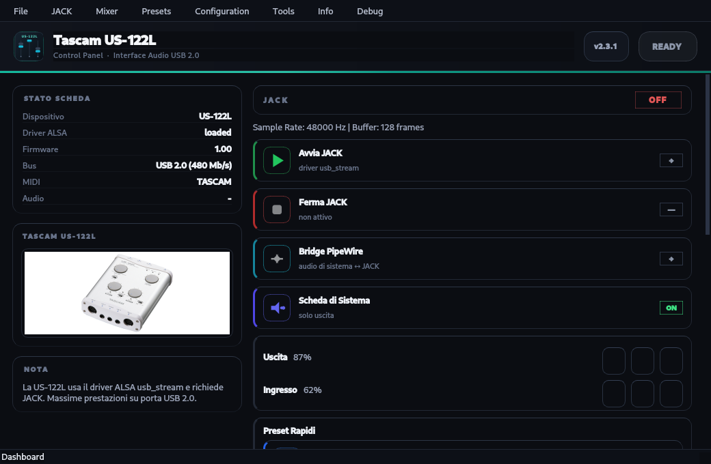

# Tascam US-122L Manager

[](LICENSE)
[](https://github.com/bronco420/tascam-us122l-manager/actions/workflows/build.yml)

Professional audio interface control tool for the **Tascam US-122L** on Linux.

> **Note about assets**: product photographs and the Tascam logo shipped in
> `resources/` are property of TEAC Corporation / Tascam and are used for
> identification purposes only. All other code is MIT-licensed.



## Features

- JACK audio server management
- PipeWire-JACK bridge
- System card mode (Tascam as system audio)
- Real-time mixer controls
- Quick presets (Studio, Standard, Live, Hi-Res)
- Watchdog for automatic JACK restart
- Auto-start at login
- Full diagnostics and MIDI support

## Requirements

- CMake 3.16+
- Qt6 (Core, Widgets)
- JACK (jackd, libjack)
- PipeWire (pipewire-pulse)
- ALSA (alsa-lib, alsa-plugins)
- Python 3 (launcher script for jackd)
- C++17 compiler

## Installation

### Build

```bash
cd tascam-manager
./build.sh
```

This will:
1. Check for dependencies
2. Configure CMake
3. Build the project (binary in `build/`)
4. Install the jackd launcher script to `~/.local/bin/`

Run the binary directly from the build directory:

```bash
build/tascam-us122l-manager
```

### System-wide Install (optional, requires sudo)

```bash
./build.sh --install
```

### User-only Install (no sudo)

```bash
cmake --install build --prefix $HOME/.local
```

### Install Dependencies (Arch)

```bash
sudo pacman -S cmake ninja qt6-base jack pipewire alsa-lib python
```

### Debian/Ubuntu

```bash
sudo apt install cmake ninja-build qt6-base-dev libjack-jackd2-dev libpipewire-0.3-dev libasound2-dev python3
```

### Install from .deb (Debian/Ubuntu)

Download `tascam-us122l-manager-<version>.deb` from the [Releases](https://github.com/bronco420/tascam-us122l-manager/releases) page:

```bash
sudo apt install ./tascam-us122l-manager-<version>.deb
```

Installs the binary to `/usr/bin/`, the systemd user unit to `/usr/lib/systemd/user/`,
and the desktop entry + icons to `/usr/share/`.

### Build your own .deb

```bash
cmake -G Ninja -B build-deb -DCMAKE_INSTALL_PREFIX=/usr -DBUILD_TESTING=OFF
cmake --build build-deb
cd build-deb && cpack -G DEB
```

## Usage

### GUI Mode

```bash
tascam-us122l-manager
```

This opens the native Qt Control Panel dashboard.

### Command Line

```bash
tascam-us122l-manager --start            # Start JACK
tascam-us122l-manager --stop             # Stop JACK
tascam-us122l-manager --restart          # Restart JACK
tascam-us122l-manager --status           # Show status
tascam-us122l-manager --diag             # Run diagnostics
tascam-us122l-manager --bridge on|off    # Toggle PipeWire bridge
tascam-us122l-manager --sysmode on|off   # Toggle system card
tascam-us122l-manager --watch            # Start watchdog
tascam-us122l-manager --watch-stop       # Stop watchdog
tascam-us122l-manager --autostart on|off # Enable/disable auto-start
tascam-us122l-manager --silent           # No dialogs (for scripts/systemd)
tascam-us122l-manager --screenshot out.png  # Render dashboard to PNG (docs)
```

## Architecture

```
tascam-manager/
├── src/
│   ├── main.cpp                    # Application entry point
│   ├── core/
│   │   ├── jack_manager.h/cpp      # JACK server management
│   │   ├── pipewire_bridge.h/cpp   # PipeWire-JACK bridge
│   │   ├── sysmode.h/cpp           # System card mode
│   │   ├── mixer.h/cpp             # Volume and mute controls
│   │   ├── preset.h/cpp            # Quick presets
│   │   ├── watchdog.h/cpp          # Automatic restart
│   │   ├── diagnostics.h/cpp       # Diagnostics
│   │   ├── config.h/cpp            # Configuration management
│   │   └── utils.h/cpp             # Utility functions
│   └── gui/
│       ├── main_window.h/cpp       # Main application window
│       ├── dashboard_widget.h/cpp  # Native Qt control panel dashboard
│       ├── mixer_widget.h/cpp      # Volume mixer
│       ├── preset_widget.h/cpp     # Preset selection
│       ├── config_widget.h/cpp     # JACK configuration
│       ├── info_widget.h/cpp       # Card and system info
│       ├── documentation_widget.h/cpp  # Documentation
│       └── diagnostics_widget.h/cpp  # Diagnostics report
├── cmake/
│   ├── tascam-us122l.service.in    # Systemd service template
│   └── autostart.sh.in             # Auto-start script template
├── resources/
│   ├── resources.qrc               # Qt resource file
│   └── icons/                      # Application icons
├── docs/                           # Extended documentation
│   ├── ARCHITECTURE.md             # System architecture
│   ├── QUICKSTART.md               # Quick start guide
│   └── HISTORY.md                  # Project history
├── CMakeLists.txt                  # Build configuration
├── build.sh                        # Build script
└── README.md                       # This file
```

See [`docs/ARCHITECTURE.md`](docs/ARCHITECTURE.md) for the full system design.

## Roadmap

- Real unit/integration tests (beyond the initial CI smoke test)
- MIDI editor widget
- Audio recording/playback
- VU meter real-time display
- System tray integration
- Multi-language UI (Italian, English)

Idea contributions and bug reports are welcome via GitHub Issues.

## Configuration Files

- `~/.asoundrc` - ALSA usb_stream configuration
- `~/.config/tascam-us122l/settings.conf` - JACK parameters
- `~/.config/tascam-us122l/state.conf` - Runtime state
- `~/.config/tascam-us122l/jack.log` - JACK log file
- `~/.config/systemd/user/tascam-us122l.service` - Auto-start service

## Presets

- **Studio**: 44.1 kHz, buffer 256, periodi 3 (recording)
- **Standard**: 48 kHz, buffer 128, periodi 2 (general use)
- **Live**: 48 kHz, buffer 64, periodi 3 (low latency)
- **Hi-Res**: 96 kHz, buffer 256, periodi 3 (high fidelity)

## Troubleshooting

### JACK won't start

1. Check if the card is detected: `cat /proc/asound/cards`
2. Verify driver is loaded: `lsmod | grep snd_usb_us122l`
3. Check JACK log: `cat ~/.config/tascam-us122l/jack.log`
4. Try increasing buffer size or periods

### Audio not working

1. Verify JACK is running: `jack_lsp -l`
2. Check PipeWire bridge status
3. Ensure you're in the audio group: `groups`

### MIDI not working

1. Check MIDI device: `amidi -l`
2. Verify MIDI client: `aconnect -l`
3. Test MIDI loopback from the GUI: open the Dashboard → "Test MIDI"

## Testing

```bash
cd build
ctest
```

## License

This project is licensed under the MIT License.

## Credits

Original bash version: Tascam US-122L Manager v2.3
C++ rewrite: Maintains 100% of original functionality